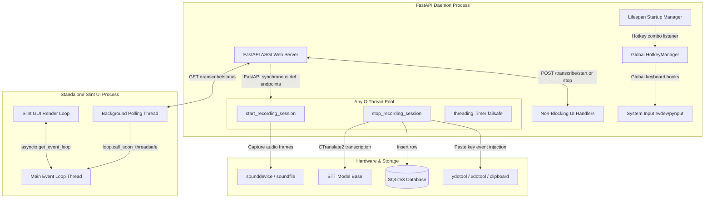

# 🎙️ carefulWhisper
> **A local-first, low-latency dictation backend and desktop GUI featuring real-time IPC synchronization, smart post-processing, and global hotkeys.**

---

[](https://www.python.org/)
[](https://fastapi.tiangolo.com/)
[](https://slint.dev/)
[](https://sqlite.org/)
[](#)

---

## 🛠️ The Tech Stack

This project was built to showcase production-grade desktop engineering, local-first performance, and modern asynchronous paradigms.

| Component | Technology | Rationale & Architectural Fit |
| :--- | :--- | :--- |
| **STT Engine** | **CTranslate2 / `faster-whisper`** | High-performance, quantized (int8/float16) implementation of OpenAI's Whisper model. Up to **4x faster** than the original library with significantly reduced VRAM/RAM footprints, utilizing a **lazy-loaded singleton** pattern. |
| **Desktop GUI** | **Slint UI Framework** | A state-of-the-art, Rust-powered declarative UI framework. Chosen over Electron or traditional heavy frameworks for its **ultra-lightweight memory footprint**, native desktop speeds, and unified asynchronous loop bindings in Python. |
| **Web Server / Daemon** | **FastAPI (ASGI)** | High-performance async gateway serving as the daemon. Leverages Uvicorn and ASGI event-loops to coordinate requests, while routing blocking CPU/STT operations to external worker threads to prevent event loop bottlenecks. |
| **Database** | **SQLite3** | Embedded, local-first, zero-configuration database utilizing a custom **HistoryStore** abstraction layer to save, list, search, and delete past transcripts with elided previews. |
| **System Tray** | **`pystray`** | Custom OS-native tray menu daemon integration running on linux `appindicator`/DBus pipelines, managing UI subprocess life-cycles and backend connections. |
| **Global Hooking** | **`evdev` & `pynput`** | Dynamic environment-aware keyboard listener. Auto-switches to Wayland-compatible `evdev` when `XDG_SESSION_TYPE=wayland` (requiring local permissions), falling back to `pynput` on standard X11 or other desktop sessions. |
| **Post-Processing** | **`text2num` & `ftfy`** | Text normalizer correcting raw phonetic numbers into integer digits and resolving unicode/charset translation bugs prior to database insertions and paste integrations. |

---

## 🏗️ Technical Architecture & IPC Lifecycle

To keep the UI snappy and ensure the background global hotkey-listener runs with zero latency, the project implements a **multi-process, multi-threaded architecture** linked by a custom **Inter-Process Communication (IPC)** bridge.



### Key Architectural Patterns
1. **Unblocked Event Loops:** CPU-bound dictation and CTranslate2 transcription run on an **AnyIO thread pool** (via FastAPI's synchronous `def` endpoints), ensuring the main server ASGI event loop is never blocked. This guarantees the Status API remains highly responsive during heavy processing.
2. **Standard `asyncio` Thread-Safe Sync:** The Slint UI runs an asynchronous event loop (`slint.run_event_loop`). A background daemon thread polls the backend state every 250ms and dispatches updates thread-safely back to the main UI thread via `loop.call_soon_threadsafe()`.
3. **Automatic History Sync:** When a polling cycle detects a state transition from `transcribing` or `recording` back to `idle`, the UI thread automatically re-triggers a SQLite database query, causing the newly transcribed text to pop up in the History tab instantly.
4. **Failsafe Duration Cutoff:** Dictation is protected by a thread-safe **180-second** (3 minutes) daemon `threading.Timer` guard in the backend. If a user forgets to stop dictating, the backend automatically halts the stream, processes the transcript, and resets the UI state, protecting local RAM/CPU resources from overflows.

---

## ✨ Features

- 🟢 **Local-First Privacy:** Absolute local computation. Your voice transcripts are processed on your local CPU/GPU and saved on your local SQLite instance.
- 🔴 **High-Fidelity Visual State Indicators:** Responsive, modern design with animated circular badges:
  - **Ready (Idle):** Neutral mic icon 🎙, soft color palette.
  - **Recording:** Pulse-indicator glowing red ring 🔴, custom cursor styles, micro-hints.
  - **Transcribing:** Rotating status wheel ⚙️, loading indicators.
- 📋 **Integrated Clipboard Pasting:** Automatically pastes completed text directly into your active input field at your cursor position using Wayland-compatible `ydotool` or X11 `xdotool` key injection pipelines.
- 🔍 **History Dashboard:** Search, browse, copy, and delete confirmation overlay for past dictations, built using a custom scroll layout.
- 💡 **Fuzzy LLM Triggering:** Supports fuzzy keyword detection (e.g. "fix now", "fix this") to automatically pass your finished transcript to a local LLM API for grammar, punctuation, and structural cleanup before pasting.

---

## 🚀 Quick Start

### 1. Run the Backend & System Tray

First, compile and sync project dependencies inside your virtual environment:

```bash
uv sync
```

Launch the combined FastAPI daemon and System Tray application:

```bash
uv run carefulwhisper
```
*The daemon will spin up FastAPI on port `7331` in a background thread, while launching the native Linux AppIndicator tray icon in the main blocking thread.*

### 2. Launch the Desktop GUI Standalone

```bash
uv run python -m ui
```
*Alternatively, you can open it at any time by clicking **"Open Slint UI"** from the system tray menu.*

---

## 📚 Project Structure

```
carefulWhisper/
├── backend/                  # Python FastAPI Core Daemon
│   ├── routers/
│   │   ├── transcribe.py     # Core STT endpoints, status APIs, failsafe timers
│   │   ├── history.py        # SQLite list/delete routes
│   │   └── ...
│   ├── audio.py              # sounddevice InputStream frame capture
│   ├── hotkey.py             # Global keyboard hook listener (evdev / pynput)
│   ├── output.py             # Active window text paste injector (ydotool / xdotool)
│   ├── tray.py               # Native OS AppIndicator system tray implementation
│   └── main.py               # Combined ASGI backend startup and lifecycle manager
│
├── ui/                       # Declarative Slint Desktop App
│   ├── pages/
│   │   ├── home-page.slint   # Responsive click-to-toggle dictation view
│   │   └── history-page.slint# Custom scroll list and TextInput search bar
│   ├── components/           # Modular Slint widgets
│   ├── theme.slint           # Unified CSS/dark-mode palette tokens
│   ├── app-window.slint      # Main shell layout, tabs, and overlays
│   └── main.py               # Python asyncio thread-safe event loop wiring
│
├── pyproject.toml            # Project packaging & dependencies (slint-python, sounddevice)
├── README.md                 # Project presentation
├── WORKFLOW.md               # Detailed request lifecycle and architecture trace
└── AGENTS.md                 # Agent-level instructions, gotchas, and constraints
```
